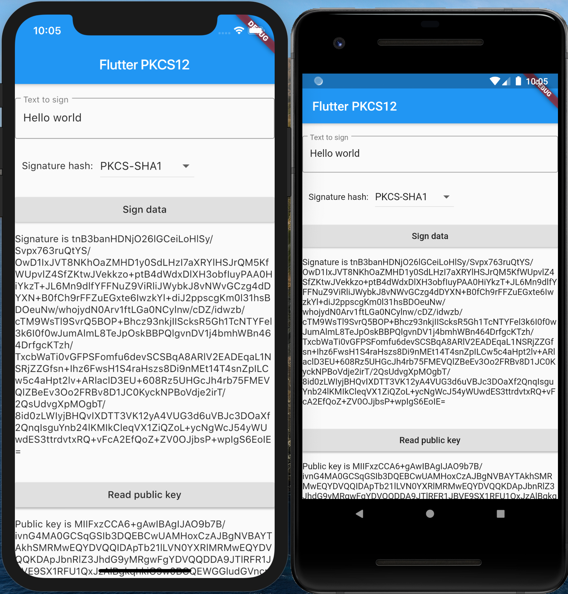

# flutter_pkcs12_example

Demonstrates how to use the flutter_pkcs12 plugin.

## Getting Started

Just run the example, enter the string to sign and press 'Sign data'.
String is transformed to a series of UTF-8 bytes and signed with example key included in assets.

Native plugin will hash these UTF-8 bytes automatically with hash you selected before signing.
Signed result is Base64 string representation of RSA signature with PKCS1 padding.
Both iOS & Android should produce same output when same key, data and hash algorithm is used.
